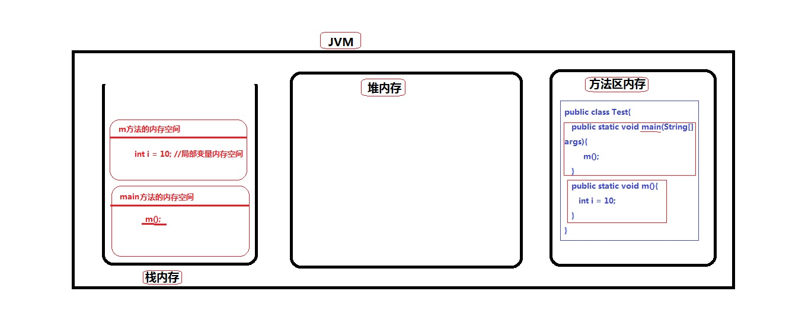
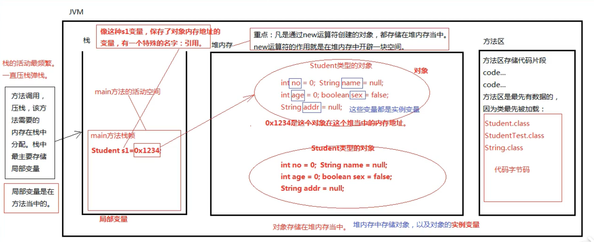
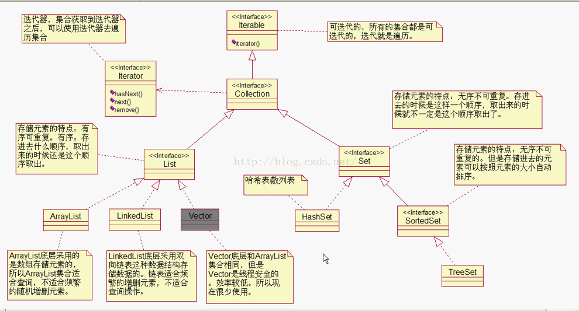
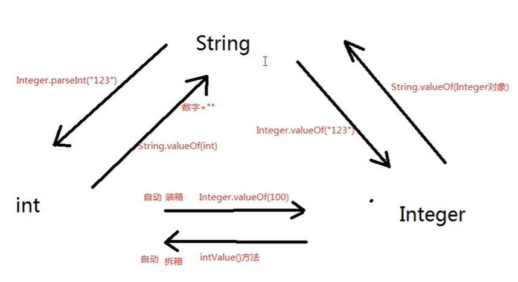

# 1. 方法

## 方法重载

### 应用场景

1. 同一个类中，“功能1”和“功能2”相似

2. 方法名相同

3. 参数列表不同

   - 参数个数不同

   - 参数类型不同

   - 参数顺序不同

> 注：方法是否重载与返回值类型没有关系，只与方法名以及参数列表有关

```java
public static int m5(){
    return 1;
}
public static double m5(){
    return 1.0;
}
```


## 方法调用与栈内存

1. JVM包括3块内存空间：栈内存 堆内存 方法区内存
   - 方法区存放代码片段
   - 栈内存分配方法区需要的内存，最主要是*局部变量*
   - 堆内存存储`new`运算符产生的对象所需空间，主要为对象及对象的实例变量
2. 方法调用的时候，该方法的内存空间在栈内存中分配，称为压栈。
3. 方法执行结束后，该方法所属内存空间释放，称为弹栈。




## 方法调用时的参数传递

> java方法调用传参规则
>
> - 不管是基本数据类型还是引用数据类型，都是将变量中保存的哪个“值”复制一份传过去


参数为基本数据类型

```java
public class Test1{
    public static void main(String[] args){
        int i = 10;
        add(i);
        System.out.println("main-->" + i);	//10
    }
    public static void add(int i){
        i++;
        System.out.println("add-->" + i);	//11
    }
}
```


参数为引用数据类型

```java
public class Test2{
    public static void main(String[] args){
        Person p = new Person();
        p.age = 10;
        add(p);
        System.out.println("main-->" + p.age)	//11
    }
    public static void add(Person p){
        p.age++;
        System.out.println("add-->" + p.age);	//11
    }
}
class Person{
    int age;
}
```

> 注：
>
> - 参数为基本数据类型时，i存在栈内存，两个栈帧存着各自的i
> - 参数为引用数据类型时，p存储的是对象在堆中的地址，两个p本质是不一样的，但指向同一个对象，因此add方法中修改了对象的age，主方法输出对象的age时也同样是11


### 

# 2. 面向对象

## 三大特征

- 封装
- 继承
- 多态


## 属性

类体中，位于方法体内的变量为局部变量，位于方法体外的变量为成员变量，成员变量即类的属性


## 创建对象

```java
Student student = new Student()
```

> 注：
>
> - 这里`student`不是对象，只是一个变量名字，保存了堆内存中对象的*地址信息*
>
> - `new Student()`是创建的对象
> - `Student`是数据类型，所有的类都是*引用数据类型*




## 变量

- 局部变量：位于方法体内
- 成员变量：位于方法体外
  - 静态变量：(static修饰)不需创建实例就可访问，所有对象共享一个变量
  - 实例变量：必须创建对象才能访问，每个对象都有单独的实例变量

```java
public class StudentofZJU{
    public static String unversity;	//StudentofZJU.number类成员变量
    public int age;	//student1.age实例变量
    public static void main(String[] args){
        numofCollege(19);
    }
    public static int numofCollege(int x){	//局部变量
        return x*10;
    }
}
```

> 注：
>
> 1. 局部变量必须初始化
>
> 2. 成员变量可以不用初始化
>    - 基本数据类型默认0或FALSE
>    - 引用数据类型默认为null


## 空指针异常

> 空引用访问实例相关的数据会出现空指针异常
>
> 实例相关数据=实例变量+实例方法

```java
public class T{
    A o1;
    public static void main(String[] args){
        D d = new D();
        C c = new C();
        B b = new B();
        A a = new A();
        T t = new T();

//以下部分注释将会报空指针异常
/*        
		c.o4 = d;
        b.o3 = c;
        a.o2 = b;
        t.o1 = a;	*/
        
        System.out.println("t.o1.o2.o3.o4.i");
    }
}
class A{
    B o2;
}
class B{
    C o3;
}
class C{
    D o4;
}
class D{
    int i;
}
```


## 构造方法

> 作用：
>
> - 创建对象
> - 给对象属性赋值

1. 当一个类中无任何构造方法，系统默认提供一个无参构造方法，这种无参数的构造方法称为缺省构造器。
2. 当一个类中手动提供了构造方法， 系统不再提供无参数构造方法。
3. 无参数构造方法和有参数构造方法都可以通过`new`来调用
4. 构造方法名必须和类名相同
5. 构造方法体中如不进行赋值操作，则系统赋默认值；若进行赋值操作，则new一个新对象时，堆存储区创建的相关属性值是前面所赋的值

```java
Student student = new Student()
```

> 后面Student()是默认的构造方法，通过`new`运算符来调用构造方法


# 3. 封装

## 作用

1. 保证内部结构安全
2. 屏蔽复杂，暴露简单


## 怎么封装

1. 属性私有化(使用`private`关键字进行修饰)
   - `private`修饰的数据只能在本类中访问
2. 对外提供简单的操作入口


## Static修饰符

1. 带static修饰符的方法/变量访问形式为——“类名.”形式，但用“引用.”也可以
2. 不带static修饰符的方法/变量访问形式为——new对象，通过“引用.”形式
3. 加static修饰符的变量叫静态变量，静态变量在类加载时初始化，不需要new对象，静态变量的空间就开出来了，存储在`方法区`


## This关键字

1. this是一个关键字，全部小写
2. this是一个变量，是一个引用。this保存当前对象的内存地址，指向自身。this存储在堆内存当中的对象内部
3. this只能使用在实例方法中，不能出现在静态方法中，谁调用这个实例方法，this就是谁。this代表“当前对象”

```java
public void shopping(){
    System.out.println(this.name + "正在购物")；
}
```

4. this.可以省略
5. this.省略的话。默认访问“当前对象”的name
6. this除了可以使用在实例方法中，还可以用在构造方法中
7. 新语法：通过当前构造方法去调用另一个本类的构造方法，可以使用如下语法格式：this（实际参数列表）——必须在构造器中第一行

```java
public class ThisTest{
    public static void main(String[] args){
        Date d1 = new Date();
        d1.detail;
        
        Date d2 = new Date(2008,8,8);
        d2.detail;
    }
}
    
class Date{
        private int year;
        private int month;
        private int day;
    
    public Date(){
        this(1970,1,1)
    }
    public Date(int year,int month,int day){
        this.year = year;
        this.month = month;
        this.day = day;
    }
    public void detail(){
        System.out.println("输入的日期为" + year + "年" + month + "月" + day + "日");
    }
}
```


# 4. 继承

## 作用

1. 子类继承父类，代码可以得到复用，
2. 因为用了继承关系，才有了后期的方法覆盖和多态机制


## 特性

## 

1. 子类继承父类，除了构造方法外都可以继承
2. 私有属性(`private`修饰的)无法在子类中直接访问，可以通过间接的方式访问
3. `java`中的类没有显示继承任何类，则默认继承Object类
4. `Object`是所有类的超类，类体结构中的根


## 使用

- 在实际使用中，凡是采用"is a"能描述的，都可以继承


# 5. 方法覆盖

## 目的

- 子类继承父类中，有些“行为”不需要改进，有些“行为”可能面临着必须改进
- 子类有权利对父类方法进行重写，有必要进行“方法的覆盖“


## 条件

1. 两个类必须有继承关系
2. 重写之后的方法和之前的方法具有
   - 相同的返回值类型
   - 相同的方法名
   - 相同的形式参数列表

3. 访问权限不能更低，可以更高
4. 重写之后的方法不能比之前的方法抛出更多的异常，可以更少


> 注意：
>
> 1. 方法覆盖只针对方法，和属性无关
> 2. 私有方法无法覆盖
> 3. 构造方法不能被继承，所以构造方法也不能被覆盖
> 4. 方法覆盖只针对实例方法，静态方法覆盖没有意义


# 6. 多态

## 概念基础

1. 向上转型

   - 子-->父	自动类型转换

   ```java
   Animal() a1 = new Cat();
   ```

   - 向上转型不存在风险

2. 向下转型

   - 父-->子	强制类型转换
   - 当调用的方法子类中特有的方法时，需要向下转型

   ```java
   Animal a5 = new Cat();
   Cat() x = (Cat)a5;
   x.catchMouse();
   ```

   - 向下转型存在风险，以上程序应修改为

   ```java
   if(a5 instanceof Cat){
       Cat() x = (Cat)a5;
   }
   ```

   


## 含义

```java
Animal a1 = new Cat();
a1.move();
```


多种形态，多种状态。java程序分为编译阶段和运行阶段。

1. 编译阶段：编译器只知道a1类型是Animal，所以会去Animal.class找move()方法，找到了，绑定上move()方法，编译通过，`静态绑定`成功
2. 运行阶段：实际在堆内存中创建java对象是Cat对象，所以move时真正参与move的对象是一只猫，运行阶段会动态执行Cat()对象的move()方法。这个过程属于运行阶段`动态绑定`。


## 静态方法不存在方法覆盖

```java
public class OverrideTest{
    public static void main(String[] args){
        Animal a = new Cat();
        a.doSome();		//Animal的doSome方法执行
    }
}

class Animal{
    public static void doSome(){
        System.out.println("Animal的doSome方法执行！");
    }
}

class Cat extends Animal{
    public static void doSome(){
        System.out.println("Cat的doSome方法执行！")
    } 
}
```

> - 方法覆盖和多态结合起来才有意义
> - 静态方法不存在方法覆盖，对象.方法等同于类名.方法，所以这里调用Animal类中的方法


## 总结

> - 私有不能覆盖
> - 静态不谈覆盖


# 7. Final

1. final修饰的类无法被继承
2. final修饰的方法无法被覆盖
3. final修饰的局部变量，一旦被赋值无法重新赋值。即`final`修饰的变量只能赋一次值
4. final修饰的实例变量，系统不赋默认值，要求程序员必须手动赋值。该实例变量不会随对象的改变而改变，因此一般和`static`一起使用，即`static final`
5. `static final`修饰的变量就成了常量，常量名一般大写，每个单词用下划线连接。
6. 常量和静态变量都存储在方法区，类加载时初始化

```java
final double height = 1.8;
```

> final的核心思想
>
> - final修饰的变量只能赋值一次


# 8. 抽象类

1. 类和类之间具有共同特征，将这些共同特征提取出来就构成抽象类

2. 抽象类属于引用数据类型，但无法实例化，抽象类用来被子类继承的

3. `abstract`和`final`不能同时出现

4. 抽象类关联概念：抽象方法

   ```java
   public abstract void doSome();
   ```

   - 没有方法体，以分号结尾
   - 前边修饰符列表中有`abstract`关键字

5. **非抽象类继承抽象类必须将抽象类中的抽象方法覆盖**，否则编译器会报错

6. 作用：降低接口实现类对接口实现过程难度，将接口中不需要使用的抽象方法交给抽象类进行完成，这样接口实现类只需要对接口需要的方法进行重写


# 9. 接口

1. 接口也是一种引用数据类型，编译之后也是一个class字节码文件

2. 接口是完全抽象的。（抽象类是半抽象。）或者也可以说接口是特殊的抽象类

3. 接口定义

   [修饰符列表]	interface	接口名{}

4. 接口支持多继承，一个接口可以继承多个接口
5. 接口中只包含两部分内容，一部分是：常量。另一部分是：抽象方法
6. 接口中所有元素都是public的
7. 接口中抽象方法定义时，public abstract修饰符可以省略
8. 接口中的方法都是抽象方法，所有接口中的方法不能有方法体
9. 类和类之间叫做继承`extends`，类和接口之间叫做实现`implements`。
10. **当一个非抽象的类实现接口的话，必须将接口中所有的抽象方法全部实现（覆盖）。**
11. 一个类可以可以同时实现多个接口。，但是要把接口中的方法重写

```java
class D implements A,B,C{
    
}
```

12. 接口和接口之间在进行强制类型转换的 时候，没有继承关系编译也不会报错，但运行时可能会报错


# 10. 访问控制权限

| 访问控制修饰符 | 本类 | 同包 | 子类 | 任意位置 |
| :------------- | :--: | :--: | :--: | :------: |
| public         | 可以 | 可以 | 可以 |   可以   |
| protected      | 可以 | 可以 | 可以 |   不行   |
| 默认           | 可以 | 可以 | 不行 |   不行   |
| private        | 可以 | 不行 | 不行 |   不行   |

- 属性(4个都能用)
- 方法(4个都能用)
- 类(public和默认都能用，其他不行)
- 接口(public和默认都能用，其他不行)
- 内部类(4个都能用)


# 11. 源码分析

## ==与equals

1. java中所有基本数据类型比较是否相等，使用==
2. java中所有引用数据类型同一使用equals方法来判断

> 对于引用数据类型，“==”比较的是内存地址是否相等，“equals”比较的是对象内容是否相等


## 内部类

1. 内部类：在类的内部又定义一个新的类，称为内部类
2. 内部类的分类：
   - 静态内部类：类似于静态变量
   - 实例内部类：类似于实例变量
   - 局部内部类：类似于局部变量

3. 使用内部类编写的代码可读性很差，能不用尽量不用
4. 匿名内部类是局部内部类的一种
   - 因为这个类没有名字而得命，叫做匿名内部类

```java
class Test01{
    static class Inner1{		//静态内部类
    }
    class Inner2{				//实例内部类
    }
    public void doSome(){
        int i = 100;
        class Inner{			//局部内部类
        }
    }
}
```


# 12. 数组

## 特点

优点——存储效率高

## 

1. 每一个元素的内存地址在空间存储上是连续的
2. 每一个元素类型相同，所以占用空间大小一样
3. 知道第一个元素的内存地址，知道每一个元素占用空间的大小，又知道下标，所以通过一个数学表达式就可以计算出某个下标上元素的内存地址。直接通过内存地址定位元素，所以数组的检索效率是最高的

缺点

1. 由于为了保证数组中每个元素的内存地址连续，所以在数组上随机删除或者增加元素的时候，效率较低，因为随机增删元素会涉及到后面元素统一向前或者向后位移的操作。
2. 数组不能存储大数据量，因为很难在内存空间上找到一块特别大的连续内存空间

## 声明/初始化

### 声明一维数组

```java
int[] array1;
double[] array2;
boolean[] array3;
String[] array4;
Object[] array5;
```

### 初始化一维数组

```java
//静态初始化
int[] array {100,2100,330,120};
//动态初始化
int[] array = new int[5];
```

### 何时静态/动态初始化数组

1. 当确定数组中存储哪些具体元素时，采用静态初始化方式
2. 不确定将来数组中存储哪些数据，可以采用动态初始化的方式，预先分配内存地址


# 13. 异常

## try...catch

1. catch后面的小括号中的类型可以是具体异常类型，也可以是该异常类型的父类型
2. catch可以写多个，建议catch的时候精确一个一个处理，这样有利于程序的调试
3. catch写多个的时候，从上到下，必须遵守从小到大

```java
try{
    m1();
    System.out.println("如果m1()发生异常，这里不会执行")
}catch(FileNotFoundException e){

}
System.ou.println("这里会继续执行")；
```


## 上报 OR 捕捉

1. 如果希望调用者来处理，选择throws上报
2. 其他情况使用捕捉的方式


## finally

1. 在finally子句中的代码是最后执行的，并且一定会执行的，即使try语句中间的代码出现了异常

```java
try{
	balabala；	//假设这行代码爆出异常
    System.out.println("异常时这里不会被执行！")；
}catch(FileNotFound e){
    e.printStackTrace；
}finally{
    System.out.println("这里一定会执行！")；
}

```

### final finally finalize

1. final是一个关键字。表示最终的，不变的
2. finally也是一个关键字，和try联合使用，使用在异常处理机制中，在finally语句块中的代码是一定会执行的
3. fianlize()是Object类的一个方法，作为方法名出现


# 14. 集合

1. 集合在java中本身是一个容器，是一个对象
2. 集合中存储的不能是基本数据类型，只能是<u>引用</u>
3. java中集合分为两大类
   - 单个方式存储元素，这一类集合中超级父接口：java.util.Collection
   - 以键值对的方式存储元素，这一类集合中超级父接口：java.util.Map



 

## Collection

1. 没有使用泛型之前，Collection可是存储Object的所有子类型

2. 使用了泛型后，Collection中只能存储某个具体类型

3. 放在集合中的元素类型，必须重写equals方法

4. ```java
   import java.util.ArrayList;
   import java.util.Collection;
   import java.util.Iterator;
   
   public class Test {
       public static void main(String[] args) {
           String s1 = new String("abc");
           String s2 = new String("abc");
           Collection a = new ArrayList();
           Iterator it = a.iterator();	
   //迭代器放在这里会报异常java.util.ConcurrentModificationException，集合结构只要发生改变，迭代器必须重新获取
           a.add(s1);
           a.add(s2);
           a.add(3);	//Integer类型
   //        Iterator it = a.iterator();	//迭代器放在这里正确
           while (it.hasNext()){
               Object obj = it.next();		//it.next()默认都是Object类型
   //            a.remove(s1);		//集合迭代过程中不能调用集合的删除方法，改变集合结构迭代器会报异常
   //			it.remove();        //可以调用迭代器的删除方法，删除迭代器当前指向的元素  
               System.out.println(obj);
           }
       }
   }
   ```


## 泛型

```java
//泛型
ArrayList<Animal> myList = new ArrayList<Animal>();
//类型自动推断  since8.0
ArrayList<Animal> myList = new ArrayList<>();

//迭代
Iretator<Animal> it = myList.iterator();
```

泛型的特点

1. 遍历集合时`it.next()`返回是Animal类型，不再是Object类型
2. 集合中只能存储Animal类型，限制了其他类型的存储

## Set

1. set集合没有下标，只能遍历不能取
2. 存放到HashMap的key部分元素必须同时重写Hashcode和equals方法
3. 对于接口Collection下的子类，可以通过构造方法直接进行集合类型之间转换 list-->set    set-->list
4. set和map之间不能直接转，maps转为set       keySet()方法

## Map

1. Map和Collection没有继承关系
2. Map集合以key和value的方式存储数据：键值对
3. key和value都是引用数据类型
4. key和value都是存储对象的内存地址
5. key起到主导作用，value是key的一个附属品
6. 放在HashMap集合Key部分的，以及放在HashSet集合中的元素，需要同时重写HashCode方法和equals方法
7. HashMap的key和value都可以为null,Hashtable的key和value都不可以为null

### TreeSet

1. 放到TreeSet或者TreeMap集合key部分的元素要想做到排序，包括两种方式：
   - 放在集合中的元素实现java.lang.Comparable接口
   - 在构造TreeSet或者TreeMap集合的时候给他传一个比较器对象

2. Comparable和Comparator如何选择？
   - 当比较规则不会发生改变的时候，或者说当比较规则只有1个的时候，建议实现Comparable接口
   - 如果比较规则有多个，并且需要多个比较规则之间频繁切换，建议使用Comparator接口

# 15. 其他

## 8个包装类

> 场景：调用doSome()方法的时候需要传一个数字进去，但是数字属于基本数据类型，而doSome()方法参数的类型是Object。

| 基本数据类型 | 包装类型            |
| ------------ | ------------------- |
| byte         | java.lang.Byte      |
| short        | java.lang.Short     |
| int          | java.lang.Integer   |
| long         | java.lang.Long      |
| float        | java.lang.Float     |
| double       | java.lang.Double    |
| boolean      | java.lang.Boolean   |
| char         | java.lang.Character |


## String、int、Integer转化



```java
//String-->int
String s1 = "100"
int i1 = Integer.parseInt(s1)
    
//int-->String
s2 = i1 + ""
s2 = String.valueOf(i1)
    
//int-->Integer
//自动装箱
Integer x = 1000
    
//Integer-->int
//自动拆箱
int y = x 
    
//String-->Integer
Interger k = Integer.valueOf("123")
    
//Integer-->String
String e = String.valueOf(k)    
    
```

## 日期处理

```java
//Date-->String
Date nowTime = new Date();
SimpleDateFormat sdf = new SimpleDateFormat("yyyy-MM-dd HH:mm:ss");
String nowTimeStr = sdf.format(nowTime);
System.out.println(nowTimeStr);

//String-->Date
String time = "2020-05-20 20:09:27";
SimpleDateFormat sdf2 = new SimpleDateFormat("yyyy-MM-dd HH:mm:ss");
Date dateTime = sdf2.parse(time);
System.out.println(datetime);
```

## 增强for循环

```java
int[] arr={1,2,3,4,5};

for(int data:arr)
    System.out.println(data)
```


# 16. IO流

## 四大家族

1. java.io.InputStream	字节输入流
2. java.io.OutputStream    字节输出流
3. java.io.Reader      字符输入流
4. java.io.Writer        字符输出流

> 注：1、在Java中，只要类名以“Stream”结尾的都是字节流，以“Reader/Writer”结尾的都是字		符流
>
> ​		 2、以上四大家族首领都是抽象类，都实现了closeable()接口，closeable()接口下有close()		方法，表明所有流都是可关闭的，用完流以后一定要关闭
>
> ​		3、所有输出流都实现了java.io.Flushable接口，都是可刷新的，都有flush()方法，输出流		在最终输出以后，一定要flush()一下，表示将管道当中剩余未输出数据强行输出完(清空		管道)，如果没有flush可能丢失数据


## 需要掌握的16个流

```java
//文件专属
java.io.FileInputStream
java.io.FileOutputStream
java.io.FileReader
java.io.FileWriter
    
//转换流(将字节流转化为字符流)
java.io.InputStreamReader
java.io.OutputStreamReader
    
//缓冲流专属
java.io.BufferedReader
java.io.BufferedWriter
java.io.BufferedInputStream
java.io.BufferedOutputStream
    
//数据流专属
java.io.DataInputStream
java.io.DataOutputStream
    
//标准输出流
java.io.PrintWriter
java.io.PrintStream
    
//对象专属流
java.io.ObjectInputStream
java.io.ObjectOutputStream
```

## 示例

1. FileInputStream最终版

```java
import java.io.FileInputStream;
import java.io.FileNotFoundException;
import java.io.IOException;
import java.io.Serializable;

public class Test01 implements Serializable {
    public static void main(String[] args) {
        FileInputStream fis = null;
        try {
            fis = new FileInputStream("C:\\Users\\Administrator\\Desktop\\test.txt");
            byte[] data1 = new byte[4];
            int fileData = 0;
            while ((readcount=fis.read(data1)) != -1){
                System.out.print(new String(data1,0,readcount));
            }
        } catch (FileNotFoundException e) {
            e.printStackTrace();
        } catch (IOException e) {
            e.printStackTrace();
        } finally {
            if(fis != null){
                try {
                    fis.close();
                } catch (IOException e) {
                    e.printStackTrace();
                }
            }
        }
    }
}
```

2. FileWriter最终版

```java
import java.io.FileInputStream;
import java.io.FileNotFoundException;
import java.io.IOException;
import java.io.Serializable;

public class Test01 implements Serializable {
    public static void main(String[] args) {
        FileWriter fw = null;
        try {
            fw = new FileReader("C:\\Users\\Administrator\\Desktop\\test.txt");
			char[] chars = {'浙','江','大','学'};
            out.write(chars);
            out.write(chars,2,3);
            out.write("控制科学与工程");
        } catch (FileNotFoundException e) {
            e.printStackTrace();
        } catch (IOException e) {
            e.printStackTrace();
        } finally {
            if(fw != null){
                try {
                    fw.close();
                } catch (IOException e) {
                    e.printStackTrace();
                }
            }
        }
    }
}
```


2. FileReader和FileWriter复制文件

```java
import java.io.*;

public class Test02 {
    public static void main(String[] args) {
        FileReader fr = null;
        FileWriter fw = null;
        try {
            fr = new FileReader("C:\\Users\\Administrator\\Desktop\\test.txt");
            fw = new FileWriter("D:\\copyedFile.txt");
            char[] chars = new char[512 * 1024];
            int charcount = 0;
            while((charcount=fr.read(chars)) != -1){
                fw.write(chars,0,charcount);
                System.out.print(new String(chars));
            }
            fw.flush();
        } catch (FileNotFoundException e) {
            e.printStackTrace();
        } catch (IOException e) {
            e.printStackTrace();
        } finally {
            if(fr != null){
                try {
                    fr.close();
                } catch (IOException e) {
                    e.printStackTrace();
                }
            }
            if(fw != null){
                try {
                    fw.close();
                } catch (IOException e) {
                    e.printStackTrace();
                }
            }
        }
    }
}
```


## File

1. File类和四大家族没有关系，所以File类不能完成文件的读和写
2. 一个FIle对象有可能是对应的目录，也可能是文件，File只是一个路径名的抽象表示形式

## 序列化与反序列化

1. 序列化：Serialize     java对象存储到文件中，将java对象的状态保存下来的过程
2. 反序列化：DeSerialize     将硬盘上的上的数据重新恢复到内存当中，恢复成java

> 参与序列化和反序列化的对象，必须实现Serializable接口
>
> Serializable接口为空，是一个标志接口，虚拟机看到Serializable接口后会自动生成一个序列化版本号

3. transient关键字表示游离的，不参与序列化
4. 同时序列化多个对象需要用List

### java语言靠什么机制来分类？

1. 首先通过类名进行比对，如果类名不一样，肯定不是同一个类
2. 如果类名一样，再怎么进行类的区别？靠序列化版本号进行区分

> 缺陷：自动生成的序列化版本号，一旦代码确定后，不能进行后续修改，因为只要修改，必然重新编译，此时会生成全新的序列化版本号，这个时候java会认为这是一个全新的类
>
> 修正：凡是一个类实现了Serializable接口，建议给该类提供一个固定不变的序列化版本号，这样以后即使这个类的代码修改了，但是版本号不变，虚拟机会认为是同一个类


# 17. IO+Properties

1. 经常改变的数据，可以单独写到一个文件中，使用程序动态读取。将来只需要修改这个文件的 内容，java代码不需要改动，不需要重新编译，服务器不需要重启，就可以拿到动态信息

2. 类似于以上这种机制的文件称为配置文件，并且当配置文件中的格式是：

   key1 = value1

   key2 = value2

   的时候，我们把这种配置文件叫作属性配置文件

3. java规范中有要求：属性配置文件建议以.properties结尾，但这不是必须的


# 18. 多线程

## 进程与线程

1. 进程是一个应用程序
2. 线程是一个进程中的执行场景/执行单元
3. 一个进程可以启动多个线程
4. 进程A和进程B内存独立不共享；线程A和线程B堆内存、方法区内存共享，但是栈独立，一个线程一个栈

## 多线程的实现

```java
/*
	在java语言中实现多线程的第一种方式：

		第一步：继承java.lang.Thread;
		第二步：重写run方法.
	
	三个知识点：
		如何定义线程？
		如何创建线程？
		如何启动线程？
*/
public class ThreadTest02
{
	public static void main(String[] args){
		
		//创建线程
		Thread t = new Processor();

		//启动
		t.start(); //这段代码执行瞬间结束。告诉JVM再分配一个新的栈给t线程.
					//run不需要程序员手动调用，系统线程启动之后自动调用run方法.
		
		//t.run(); //这是普通方法调用，这样做程序只有一个线程，run方法结束之后，下面程序才能继续执行。

		//这段代码在主线程中运行.
		for(int i=0;i<10;i++){
			System.out.println("main-->" + i);
		}

		//有了多线程之后，main方法结束只是主线程栈中没有方法栈帧了。
		//但是其他线程或者其他栈中还有栈帧。
		//main方法结束，程序可能还在运行。
			
	}
}

//定义一个线程
class Processor extends Thread
{
	//重写run方法
	public void run(){
		for(int i=0;i<30;i++){
			System.out.println("run-->" + i);
		}
	}
}
```


```java
/*
	java中实现线程的第二种方式：
		第一步：写一个类实现java.lang.Runnable;接口
		第二步：实现run方法.
*/
public class ThreadTest03
{
	public static void main(String[] args){
		
		//创建线程
		Thread t = new Thread(new Processor());

		//启动
		t.start();
	}
}

//这种方式是推荐的。因为一个类实现接口之外保留了类的继承。
class Processor implements Runnable
{
	public void run(){
		for(int i=0;i<10;i++){
			System.out.println("run-->"+i);
		}
	}
}
```


```java
/*实现线程的第三种方式
	实现Callable接口
    优点：可以获取到线程的执行结果
    缺点：效率比较低，在获取t线程执行结果的时候，当前线程受阻塞，效率较低
```


## 线程安全***

### 什么时候数据在多线程并发条件下存在安全问题？

1. 多线程并发
2. 有共享数据
3. 共享数据有修改行为

### 如何解决线程安全问题？

1. 线程排队执行(不能并发)-->线程同步机制

## Synchronized

synchronized的三种写法：

1. 同步代码块

   灵活

   synchronized(线程共享对象){

   ​	同步代码块;

   }

2. 在实例方法上使用synchronized

   表示同步对象一定是this

   并且同步代码块是整个方法体

3. 在静态方法上使用synchronized

   表示找类锁

   类锁永远只有1把

   就算创建了100个对象，那类锁也只有1把

## 开发中如何解决线程安全问题？

1. 尽量使用局部变量代替“实例变量”和"静态变量"
2. 如果必须是实例变量，那么可以考虑创建多个对象，这样实例变量的内存就不共享(数据不共享，没有数据安全问题)
3. 如果不能使用局部变量，对象也不能创建多个，这个时候就只能选择synchronized了。线程同步机制


# 19. 反射机制

## 反射机制有什么用？

1. 通过java语言反射机制可以操作字节码文件


## 获取class的三种方式

```java
/*
	获取Class类型对象的三种方式
*/
import java.util.Date;

public class ReflectTest01
{
	public static void main(String[] args) throws Exception{

		//第一种方式：
		Class c1 = Class.forName("Employee"); //c1引用保存内存地址指向堆中的对象，该对象代表的是Employee整个类.

		//第二种方式：
		//java中每个类型都有 class 属性.
		Class c2 = Employee.class;

		//第三种方式：
		//java语言中任何一个java对象都有 getClass 方法
		Employee e = new Employee();
		Class c3 = e.getClass(); //c3是运行时类 (e的运行时类是Employee)
		
		//因为Employee这个类在JVM中只有一个，所以c1,c2,c3的内存地址是相同的，指向堆中唯一的一个对象.
		System.out.println(c1==c2); //true
		System.out.println(c2==c3); //true

		
		//c4,c5,c6都代表 Date这个类
		Class c4 = Date.class; //c4代表 Date这个类

		Class c5 = Class.forName("java.util.Date"); //必须写类全名，类全名带有包名.

		Date d = new Date();
		Class c6 = d.getClass();
		
		System.out.println(c4==c5); //true
		System.out.println(c5==c6); //true

		//c7代表 int 类型
		Class c7 = int.class;

	}
}
```

## 给属性赋值

```java
Class studentClass = Class.forName("com.bjpowernode.java.bean.Student");
Object obj = studentClass.newInstance();
Field noField = studentClass.getDeclaredField("no");
no.Field.set(obj.2222)
```

三要素：

- obj对象
- no属性
- 2222值

## 获得属性值

```java
noField.get(obj);
```

两要素：

- 对象Obj
- no属性

## 可变长度参数

```java
public static void m1(int... args){
    System.out.println("m方法执行了！")；
}

m1(1);	//正确
m1(1,2);	//正确
m1(int[])	//正确
    
public static void m2(String,int... args){		//正确
    System.out.println("m方法执行了！")；
}

public static void m2(String... args,int... args){		//错误
    System.out.println("m方法执行了！")；
}
```

1. 可变长参数要求的参数是：0~N个
2. 可变长参数只能有1个，且只能放最后一个
3. 可变长参数可以当作一个数组看待


# 20. 注解

## 简介

1. 注解，或者叫注释类型，英文单词是Annotation

2. 注解Annotation是一种引用数据类型，编译之后生成xxx.class文件

3. 怎么自定义注解？语法格式？

   [修饰符列表]  @interface  注释类型名{

   }

4. 注解怎么使用，用在什么地方？
   - 注解使用时的语法格式是：@注解类型名
   - 注解可以出现在类上，属性上，方法上，变量上等……注解还可以出现在注解类型上

## JDK自带注解

1. @override

   - @override这个注解只能注解方法

   - @override这个注解是给编译器参考的，和运行阶段没有关系

   - 凡是java中的方法带这个注解的，编译器都会进行编译检查，如果这个方法不是重写父类的方法，编译器会报错

2. @Deprecated
   - 不鼓励程序员使用这样的元素，通常是因为它很危险或存在更好的选择

3. @SupporessWarnings
   - 指示应该在注释元素(以及包含在该注释元素中的所有程序元素)中取消显示指定的编译器警告

## 元注解

- 用来标注"注解类型"的"注解"，称为元注解

- 常见的元注解有哪些？

  `Target`	`Retention`

## 注解属性

- 一个注解中如果有属性，那么必须给属性赋值
- 如果一个注解的属性的名字是value，并且只有一个属性的话，在使用的时候，该属性名可以省略

## 属性类型

- 可以是byte	short	long	float	double	boolean	char	String	Class	枚举类型以及以上每一种的数组形式